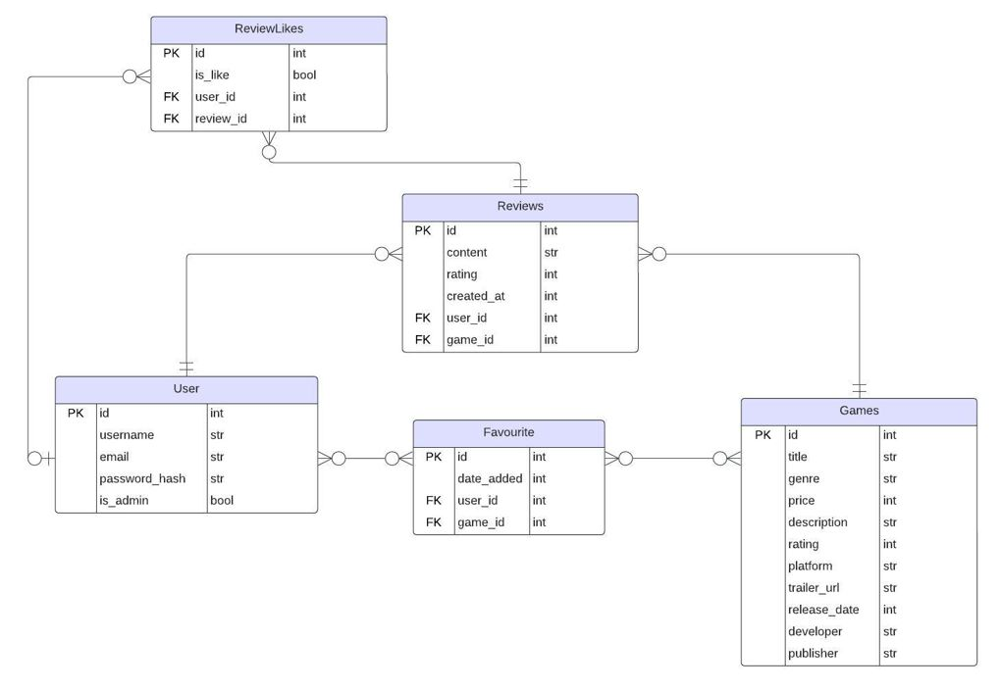

# Quest Games Hub


Welcome to Quest Games Hub, a full-stack web application built using Flask and React for managing gaming communities. This project was developed as part of my final project for phase 4 and 5 with Academy Xi. <br>

## Introduction

As a lover of games, I wanted to build something that reflected one of my biggest passions. Creating Quest Games Hub was an easy choice for me because it allowed me to merge my love for gaming with the skills I've learned throughout my journey as a software engineer. I enjoyed every step of the process, this project is a representation of everything I've learned and experienced, and I'm excited to share it with you.

## What's it About?

Quest Games Hub is a platform for gamers where users can create accounts, log in, explore and manage their favourite games, write reviews, and interact with other gamers. Admin users have additional privileges to add game listings, ensuring the platform stays up to date with the latest games.

## Features

- User authentication (sign up, log in, log out)
- Game page and further details
- Favourite games management
- Write, view, and delete reviews
- Like or dislike reviews
- Admin management of games

## Technologies Used

- Frontend: React (Vite), Bootstrap, React-Bootstrap
- Backend: Flask, Flask-SQLAlchemy, Flask-RESTful
- Database: SQLite (with Flask-SQLAlchemy ORM)
- Other Libraries: Flask-Migrate, Flask-Bcrypt, Flask-CORS, SQLAlchemy-Serializer
- Tools: Postman (for API testing)

## Getting Started

1. Clone the Repository to your local machine:

```bash
git clone https://github.com/emilychewsh/gaming-community-hub.git
cd gaming-community-hub
```

2. In a terminal (for server side), install dependencies and Set up the virtual environment using Pipenv:

```bash
cd server
pipenv install
pipenv shell
```

Set up the database:

```bash
flask db upgrade
```

Set up seeded data:

```bash
python game-seed.py
python user-seed.py
python review-seed.py
python review-likes-seed.py
```

Start the app:

```bash
python app.py
```

3. In a separate terminal (client side), install dependencies and start development:

```bash
cd client
npm install
npm run dev
```

## Entity Relationship



## Database Schema

These are the 5 tables:

### User

| Column     | Type    | Description          |
| ---------- | ------- | -------------------- |
| id         | Integer | Primary key          |
| username   | String  | User names to log in |
| first_name | String  | First name           |
| last_name  | String  | Last name            |
| email      | String  | email                |
| password   | String  | password             |
| is_admin   | Boolean | Admin or user        |

### Game

| Column       | Type    | Description        |
| ------------ | ------- | ------------------ |
| id           | Integer | Primary key        |
| title        | String  | Title of game      |
| genre        | String  | Genre of game      |
| price        | Integer | Price of game      |
| description  | String  | Storyline of game  |
| rating       | Intger  | Game rating        |
| platform     | String  | Platform available |
| trailer_url  | String  | Youtube URL        |
| release_date | Date    | Game release date  |
| developer    | String  | Game developer     |
| publisher    | String  | Game publisher     |

### Favourite

| Column  | Type    | Description             |
| ------- | ------- | ----------------------- |
| id      | Integer | Primary key             |
| user_id | Integer | Foreign Key for `users` |
| game_id | Integer | Foreign Key for `games` |

### Review

| Column     | Type    | Description             |
| ---------- | ------- | ----------------------- |
| id         | Integer | Primary key             |
| title      | String  | Review title            |
| content    | String  | Review content          |
| rating     | Integer | Game rating out of 5    |
| created_at | Date    | Date review was created |
| user_id    | Integer | Foreign Key for `users` |
| game_id    | Integer | Foreign Key for `games` |

### ReviewLike

| Column    | Type    | Description                |
| --------- | ------- | -------------------------- |
| id        | Integer | Primary key                |
| is_like   | Boolean | like/dislike other reviews |
| user_id   | Integer | Foreign Key for `users`    |
| review_id | Integer | Foreign Key for `reviews`  |

## Future Implementations

Admin Enhancements: Expand the admin features to allow more seamless game modifications and deletions, including better image management for game covers. <br />
User Interaction: Add the ability for users to comment on each other's reviews, fostering a more interactive community. <br />
Direct Messaging: Enable users to add each other as friends and send direct messages within the platform. <br />
Profile Pages: Allow users to create detailed profiles where they can showcase their favourite games, recent reviews, and other relevant information. <br />

## License

This project is licensed under the MIT License.

## Contribution Guidelines

If you would like to contribute to the project development:

1. Fork the repository.
2. Create a new branch for your feature or bug fix.
3. Make your changes and submit a pull request.

Feel free to adjust any details or formatting to better suit your project and preferences.

## Contact

For any inquiries or feedback, please contact codewithemilychew@gmail.com.
